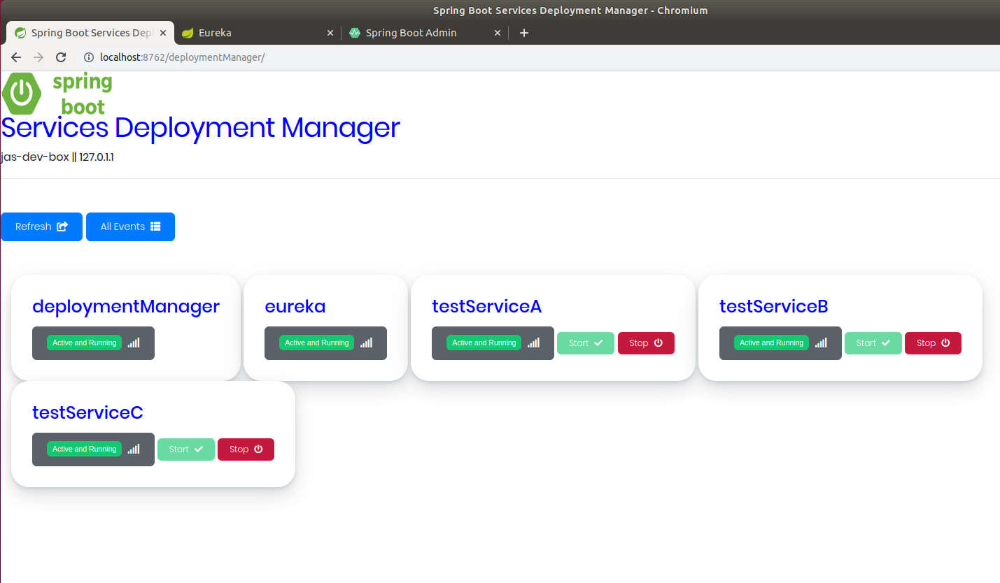
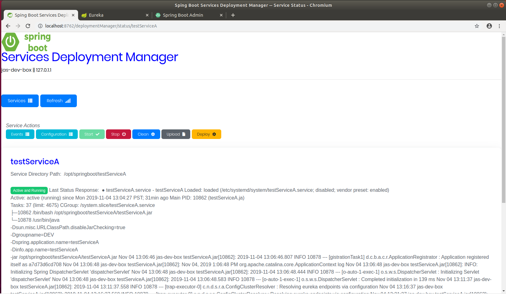
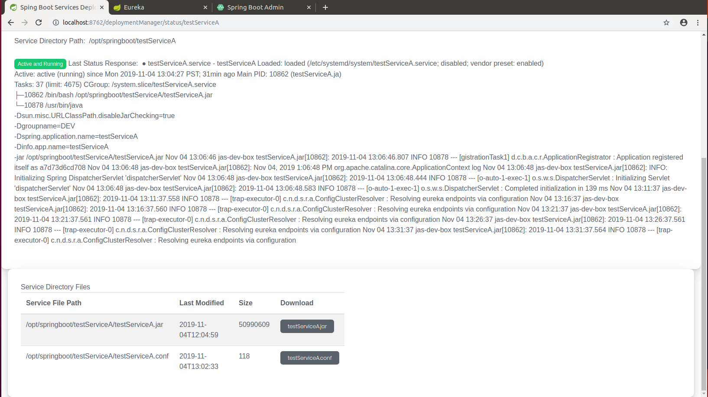
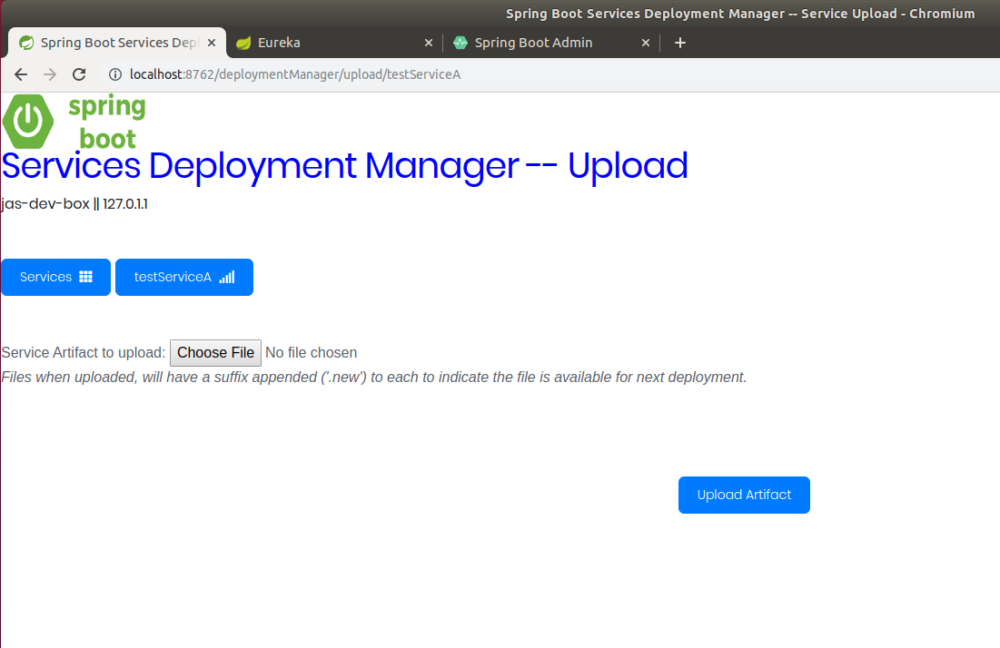
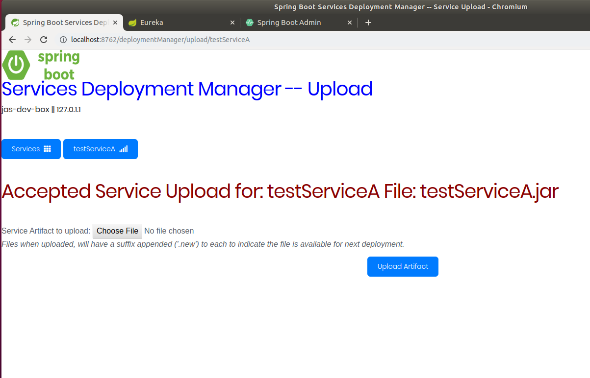
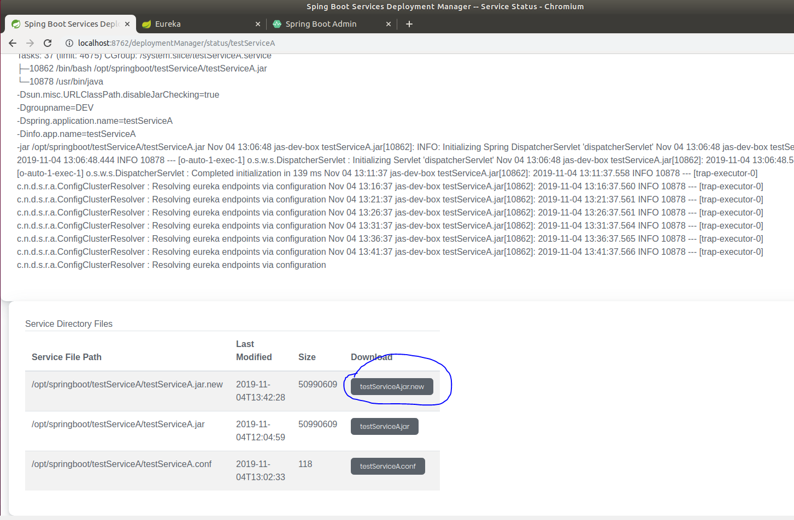
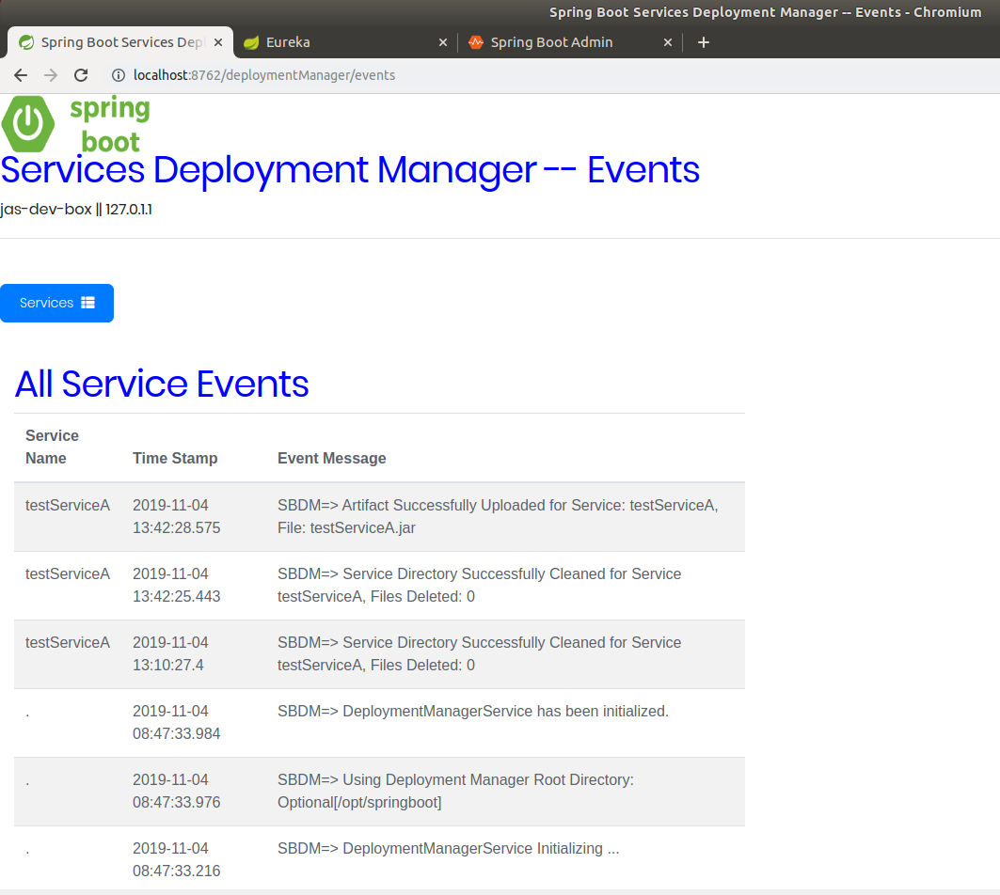

# Spring Boot Deployment Manager
This Service Application named the Spring Boot Deployment Manager will provide a utility functions to all new versions of
running Spring Boot Service instances to be deployed and maintained.

The Deployment Manager runs on a well known port for our Enterprise at **8762**.  BUt can be overridden using statdard spring.port definition.

## Upon running the Deployment Manager

The Deployment Manager has several endpoints, these are:

- Deployment Manager UI -- Available from your desktop browser
   - UI available at: **http://localhost:8762/deploymentManager/** 
     is the Deployment Manager end point on Staging 2. 
   
- Deployment Manager REST Interface -- Available for interfacing from Azure DevOps or other automation framework.
   - REST Interface available at: **http:/localhost:8762/deploymentManager/api/**    

## UI
The following outlines the initial Deployment Manager Page:


----
### Service Actions
The following outlines the various functions or actions available for a recognized 
Spring Boot Service:  


These are:
#### Events
Selecting **Events**, will display any events which are specific for the service details 
which is displayed.  Or when selected from the primary home page, you will see all events.

#### Configuration
Selecting **Configuration**, will issue a ````systemctl show <service name>```` command.
The output depicts the current configuration information for the running service at the 
Operating System level.

#### Start
Selecting **Start**, will issue a ````systemctl start <service name>```` command, which
will start an inactive service.
The current service status will be reflected on the service details page.

#### Stop
Selecting **Stop**, will issue a ````systemctl stop <service name>```` command, which
will stop an active running service.
The current service status will be reflected on the service details page.

#### Clean
Selecting **clean**, will remove any files which have not been deployed from a previous
upload.
The current service status will be reflected on the service details page.

#### Upload
Selecting **upload**, will allow you to select the various files you want to make available
for a subsequent deployment.
The current service status will be reflected on the upload page and files which were
upload will appear as **'.new'** files available for deployment.


#### Deploy
Selecting **deploy**, will deploy any **'.new'** files to the service.
The current service status will be reflected on the service details page once the process 
has been completed.  The deployment manager will construct an internal bash script which
will be executed to perform the deployment.

The Deployment script will perform the following:
1. Stop the running Service if applicable and verify it is stopped.
2. Archive existing files which will be deployed
3. Move in place the new service files.
4. Start the Service.
5. Verify Service is running. 

----
### UI Details
The following outlines an example of a Services Detail Page, where the current status of
the service is displayed with additional information on the running service. 


The following outlines the bottom of the Services Detail Page, where the current Files are 
shown for this running service: 


The following outlines the **Upload** page of the deployment manager, where new Files are 
uploaded to the service for subsequent deployment.  for this running service: 

The name of the upload file will be appended with the suffix of **'.new'**.
When uploading, ensure the name of the service running JAR name is the same name 
for the service you are ugrading.

The following outlines the **Upload** page of the deployment manager, where new Files are 
uploaded to the service for subsequent deployment.  for this running service: 


The following outlines the **Upload** status result page:


The following outlines service details page, showing the upload **'.new'** artifact available for deployment.


The following outlines the **Events** page of the deployment manager, current deployment
manager processing events are available for review:


----
## REST Services
The following outlines the various API functions which are available:

| API Request | HTTP<br/>Verb | Description |  
|-----------|:-----------:|:-----------:|  
| /deploymentManager/api/status | **GET**| <br/> Provides List of all Available Services |  
| /deploymentManager/api/status/{serviceName} | **GET**|Obtain distinct Status for Named Service | 
| /deploymentManager/api/start/{serviceName} | **PUT**|Start Named Service | 
| /deploymentManager/api/stop/{serviceName} | **PUT**|Stop running Named Service |  
| /deploymentManager/api/clean/{serviceName} | **DELETE**|Clean Up a running Named Service |
| /deploymentManager/api/deploy/{serviceName} | **POST**|Deploy previously Upload Artifacts |  
| /deploymentManager/api/upload/{serviceName} | **POST**|Upload a **new** file to be available for subsequent Deployment |    
| /deploymentManager/api/download/{serviceName}/{filename} | **GET**|Download distinct file from Named Service | 


----
## Deployment Process Flow
The following outlines the Deployment process flow for a running service:
1. Perform a **'clean'** of the service, this will remove any previous not deployed artifacts and scripts.
2. Perform an **'upload'** of new files to deploy.  The name of the upload file will be appended with the suffix of **'.new'**.
   Ensure the name of the service running JAR name is the same name for the service.  Otherwise, the service
   may not start correctly.  Since the named service JAR is specified in an internal system file.
3. Once you have all files uploaded and ready you can proceed.
4. Perform a **'deploy'** of the new service files.  If no new files are found, the deployment will
   fail and the existing service is not stopped.   
5. Check Status of running Service.

----
## Security
Currently there is no Security Implemented at this stage.  Will be implementing a simple security
layer for this Deployment Manager's UI and API facilities.

----
## Errata

* Output formatting for Configuration can still yield ill formatted text.
* No removal of Archive artifact files.  This would be a manual or scripted process.
* During Deployment spinner overlay allows 'refresh' & 'services' buttons as active.
